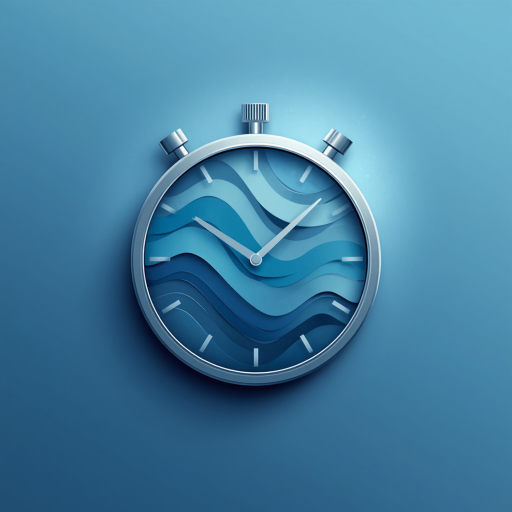
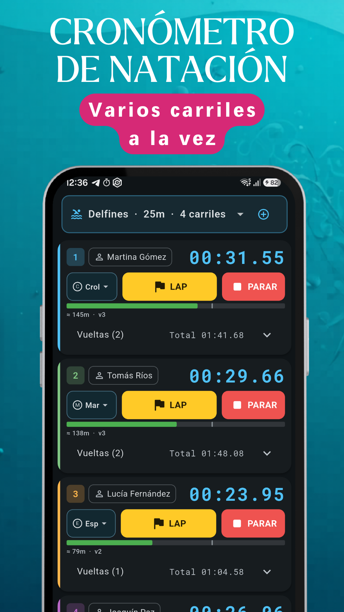
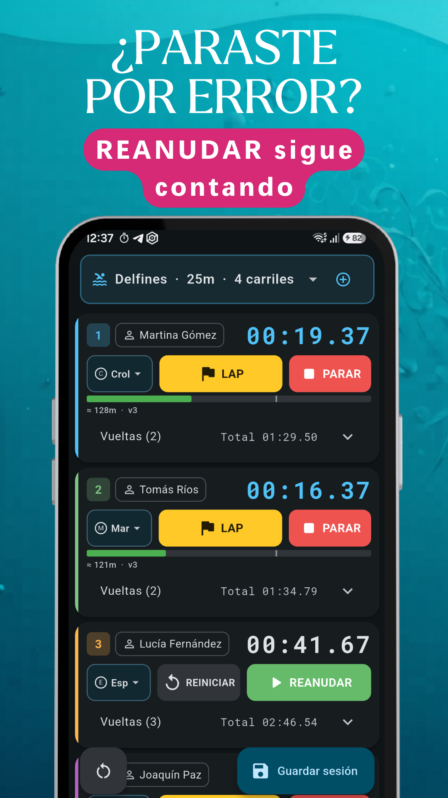
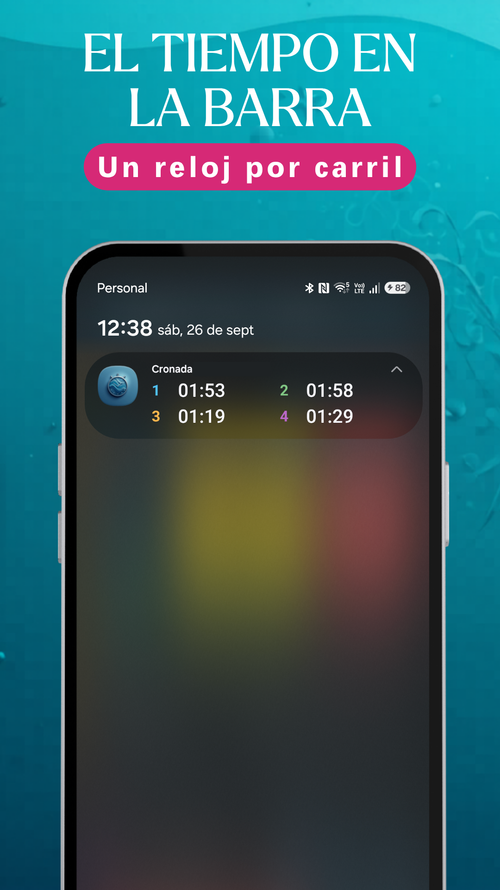
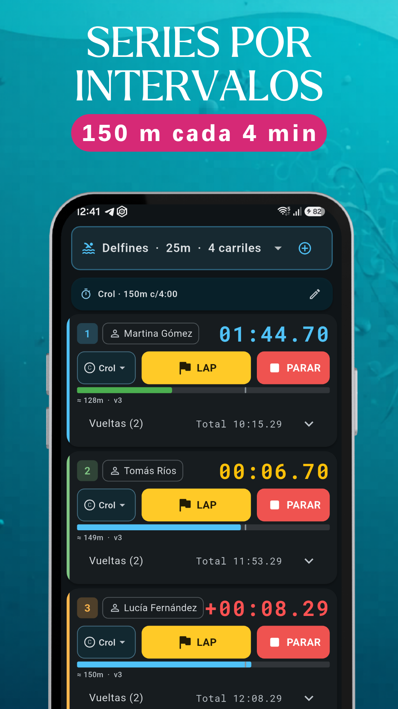

  
  <h1>Cronada — Swim Stopwatch</h1>
  
<b>Lane swimming stopwatch for coaches: splits, interval sets and history.</b>

  

  
<a href="README.md">🇦🇷 Español</a> · 🇺🇸 English

  
  
  
  

Screenshots show the app in Spanish; it is also available in English.

Cronada is the swimming stopwatch for coaches and swim teachers. Time several lanes at once, record splits, run interval sets and follow each swimmer's progress. Every feature is free.

---

## ⏱️ Lane stopwatch

- Start all lanes at once or one by one, and stop them the same way
- Big LAP and STOP buttons, and each action vibrates differently: you can tell them apart without looking
- The split stays frozen for a few seconds and the clock goes back to zero for the next lap
- Stopped a lane by mistake? RESUME keeps counting as if it had never stopped
- Swimmer and stroke per lane

## 🔁 Interval sets

- Set up a series in one tap: for example, 150 m every 4 minutes
- Countdown per lane, with an alert before each send-off

## 📲 The time, always in sight

- With the app in the background or the phone locked, the notification shows one clock per lane
- If the app gets closed, the timers are right where you left them when you come back
- If you forget a timer running, it stops by itself to save battery

## 🧮 Pace calculator

- Pace, time or distance from the other two, with /25 m, /50 m and km/h
- Long-press any time and it opens with that value already filled in

## 👥 Swimmers and history

- Swimmers with levels, and color-coded groups
- Every session saved with times and splits
- Personal bests and progress charts per swimmer
- Share swimmers with another coach through a link

## 🏅 Competition mode

- Events with name, stroke and distance
- Results with podium, and relays with splits

## 📄 Export

- Sessions to PDF and CSV, to share or analyze in a spreadsheet

## 🎨 Your way

- Dark and light theme, configurable vibration and sound
- Spanish and English
- Pools with length and number of lanes

---

## 🆓 Everything free

Every feature is free, with no limits: competition, PDF and CSV export, interval sets, calculator and history.

The free version shows a small ad on lists, details and the calculator. **Never on the stopwatch:** nothing there can be tapped by accident.

**⭐ Cronada Pro** removes ads from the whole app. One-time payment, no subscription, yours for good. If you were already Pro, you don't see ads.

---

## 🔒 Privacy

- **Your swimmers and your times never leave your phone:** they are stored only on your device
- No user accounts
- Internet for in-app purchases (Google Play Billing) and, in the free version, for Google AdMob ads
- With Cronada Pro, no ads are loaded

📄 [Full Privacy Policy](PRIVACY_POLICY.md) · 📝 [What's new (Spanish)](CHANGELOG.md)

---

## 💬 Feedback and support

Found a bug? Have a suggestion? Open an issue!

👉 [Open an issue](https://github.com/gabriel600r/cronada-feedback/issues/new)

---

## 📬 Contact

**EgeaINC** — Buenos Aires, Argentina

---

*Made with 🧉 in Argentina*
